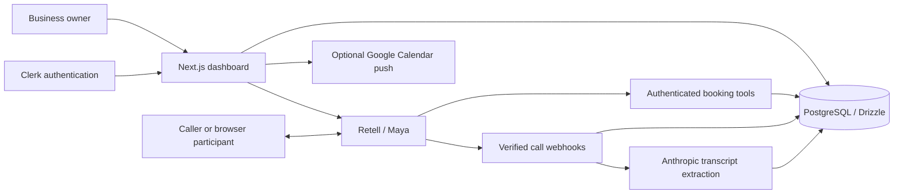

# Callzie

An AI voice agent for appointment businesses. Maya answers incoming calls, checks availability, books appointments, and calls existing customers to arrange a new time.

Built for salons, clinics, home services, and tutors, with a dashboard for calls, appointments, business hours, and conversations that need a person to follow up.

## What it does

- Handles inbound booking conversations and outbound rescheduling.
- Checks live availability and writes bookings through server-side tools.
- Prevents overlapping appointments with a PostgreSQL constraint.
- Provides browser voice calls; telephone calling requires account enablement and Retell setup.
- Stores call summaries, transcripts, outcomes, and follow-up notes.
- Supports CSV appointment imports and optional one-way Google Calendar updates.

## Architecture



Retell handles the live speech pipeline. Callzie owns the scheduling rules, booking transactions, permissions, and follow-up workflow. Managed voice lets the application focus on what a conversation is allowed to change.

## Run locally

Use a current Node.js LTS release compatible with Next.js 16, npm, and PostgreSQL with the `btree_gist` extension available. Python 3 is needed for the privacy checks.

```sh
git clone https://github.com/anushapundir/callzie-voice.git
cd callzie-voice
npm ci
cp .env.example .env.local
```

Fill in your own database connection, Clerk keys, Retell keys, Anthropic key, and internal authentication secret in `.env.local`. The template explains each setting. Google Calendar credentials are optional. Never commit your environment file.

```sh
npm run db:migrate
npm run dev
```

For real voice conversations, deploy the app at a public HTTPS URL, set `APP_URL` to that URL, and run `npm run create-agents` to provision your Retell agents. Retell must be able to reach the webhook and tool endpoints; localhost is insufficient. Provider accounts and usage are separate from the source-code license.

## Checks and contributions

```sh
npm run privacy:install
npm run privacy:hooks
npm run privacy:check
npm run privacy:test
npx next typegen
npm run typecheck
npm test
```

The application test suite starts its own temporary PostgreSQL instance and uses fixtures instead of placing real calls. Use synthetic data in contributions. See [SECURITY.md](SECURITY.md) for secret scanning, Git identity setup, and private reporting guidance.

## Boundaries

Booking tools enforce business hours and reject collisions. An unanswered call does not free an appointment slot. Failed or uncertain outcomes are surfaced for human follow-up. Maya is instructed to confirm a booking only after the booking tool succeeds.

The agent does not take payments or provide medical, legal, or safety advice. Google Calendar integration pushes changes one way; it does not import external edits. Telephone calls require explicit enablement. Voice and extraction services can fail, so review the product's limitations before using it with real customers. The full behavior and refusal rules are in [SPEC.md](SPEC.md).

## Deployment

This public repository does not deploy the original application. Its Cloud Run workflow is manual and disabled until you configure your own infrastructure and enable it. See the [deployment guide](docs/runbooks/deploying.md). Keep production container images and build artifacts private.

This release starts with a clean source snapshot. Earlier private commit history, customer data, environment files, and local recordings are not included. Historical design documents may refer to development issues that are not part of this repository.

## License

[MIT](LICENSE). Third-party dependencies remain under their respective licenses.
